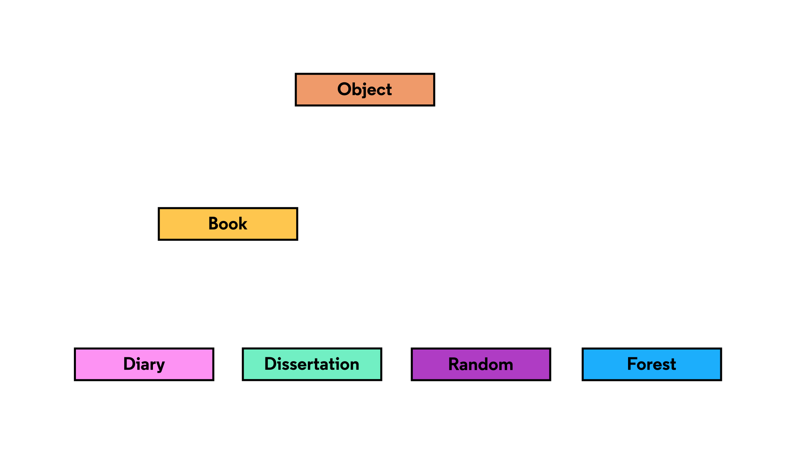

# Introduction to Object

In C# there is one type of reference that can be used for all objects. It’s aptly called `Object`.

Every class is derived from `Object`. Whether it’s the class’ superclass or the superclass’ superclass’ superclass, `Object` is at the top of the class’ inheritance hierarchy.

Since references can be upcast to any type in its inheritance hierarchy, then all types can by referenced as `Object`s:

```
Object o1 = new Dissertation();
Object o2 = new Diary();
Object o3 = new Random();
Object o4 = new Forest("Amazon");
```


If that’s so, why not use `Object` references for everything? Because the functionality of an object is limited by its reference type. We lose all of a specific type’s specific functionality when we reference it as an `Object` type. We would also lose the automatic type-checking that saves us from type errors.

When we do use them, `Object` references can be very useful! For example, if we’re not sure what type a variable is, we can safely store it as an `Object`. We can also assume that any object has access to the standard `Object` members for basic manipulation.




---

